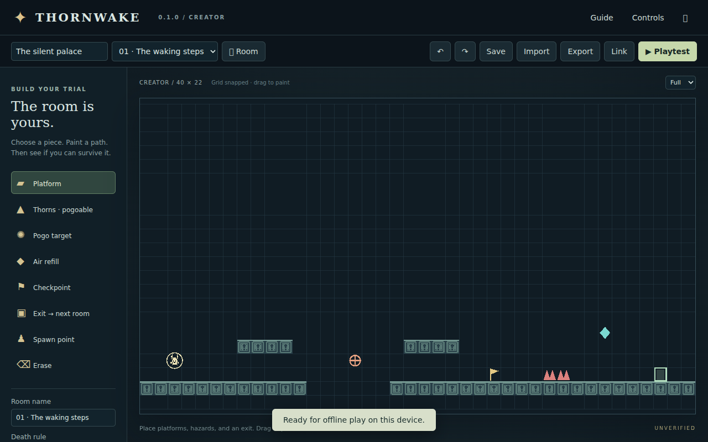

# Thornwake

**Version 0.1.1 · Creator-first precision platformer · Browser + Android touch**

Build a trial, play it immediately, and share it as an open JSON project or a compact link. Thornwake takes inspiration from precision platforming and pogo movement while building its own standalone identity.

**Current status:** playable creator prototype with two demonstration rooms. The full campaign and procedural endless mode are not implemented yet. The repository temporarily lives at `Zxaidman/Placeholder`.



## Available now

- Grid-based room painting, erasing, spawn/exit placement, and undo/redo.
- Multiple rooms connected sequentially through exits.
- Variable-height jump, double jump, wall slide/jump, dash, and timed downward pogo.
- Pogoable hazards, air refills, checkpoints, and per-room ability toggles.
- Instant-death or three-heart checkpoint rules.
- Fixed joystick or directional touch buttons, editable layouts, and custom PNG textures.
- Local project saving, validated JSON import/export, and compressed share links.
- Full, 16:9, and 4:3 viewport options, plus production PWA/offline support.

## Stack

TypeScript, Phaser 3, Vite, IndexedDB (`idb`), Zod, LZ-String, and vite-plugin-pwa. Vitest covers core rules; Playwright scripts cover browser flows. Vercel is the intended static hosting target.

## Run

Requires Node.js 24 and npm. No API keys, account system, or environment secrets.

```sh
git clone https://github.com/Zxaidman/Placeholder.git
cd Placeholder
npm ci
npm run dev
```

Open the local URL printed by Vite. For a phone on your network, use the computer's LAN address and allow the dev-server port. Installation and service workers require HTTPS (or localhost); use the Vercel deployment for phone installation/offline testing.

```sh
npm test
npm run build
npm run preview
```

`dist/` is included in the release ZIP and can be served by any static HTTP server. Do not open index.html through file://.

## Controls

| Action | Keyboard | Touch |
| --- | --- | --- |
| Move | A/D or Left/Right arrows | Fixed joystick or directional buttons |
| Jump / double jump | Space, W, or Up arrow | Jump |
| Dash | Shift or K | Dash |
| Downward pogo | Hold Down/S and press J/X | Pull joystick down (or hold Down) and tap Attack |
| Pause | Escape or Pause | Pause |
| Restart current room | Restart | Restart |

Hold Jump for a higher leap. Abilities must be enabled for the current room.

## Play and create

The app opens in Creator with two demonstration rooms. Choose Platform, Thorns, Pogo target, Air refill, Checkpoint, Exit, Spawn, or Erase. Tap/drag to paint; right-click erases. The grid is fixed at 40 × 22 cells (32 world units per cell). Set room name, death rule and movement abilities in the left panel. Undo/redo keeps 60 project snapshots. Add Room creates another sequential trial. Every room needs exactly one exit and a spawn outside solid tiles.

Playtest uses the same level data and movement code. A/D or arrows move, Space/W/Up jumps, Shift/K dashes, and Down + J/X performs a timed pogo. Hold jump for height, jump at a wall for a wall jump, and jump again in air for double jump. Spikes and orange targets are lethal except during a successful downward pogo. Cyan crystals refill air dash and double jump.

Touch defaults to a fixed joystick; pull down and press Attack to pogo. Controls supports directional buttons, drag positioning, size and opacity, saved/exported layouts, and custom PNG textures for each control. Reset controls restores defaults. Blur/backgrounding pauses and releases inputs.

Instant death restarts the room. Health mode has 3 HP: damage returns to the last touched checkpoint; losing all HP resets to room spawn. Exits advance through the project's room list. Final exit pauses at a completion screen. Restart resets the current room. Local clear labels live only in the current session and are cleared by edits; they are not included in exports or cryptographically verified.

## Files, local saving, and sharing

Save stores the active project in IndexedDB on this device. Export writes an open JSON backup. Import validates the file and can be undone. Format `thornwake`, schema version `1.0.0`; see `level.schema.json`, `examples/silent-palace.json`, and `src/model.ts`. Runtime validation adds unique room IDs, unique occupied cells, a safe spawn, and exactly one exit per room beyond the generated JSON Schema. Imported text is never used as HTML or executed.

Limits: 30 rooms, 880 objects per room, 2 MB project import. Shared links contain compressed project data in the URL fragment; the 8,000-character cap is a pragmatic bound, not a promise that every messaging application accepts it. Larger projects use files. Links work on a hosted URL running the same app. Clipboard permission is required; a denial produces an error and files remain available.

Browser storage is not a permanent backup. Export valuable projects and layouts. This version saves one active project; it has no project library, automatic campaign save, cloud sync or online gallery.

## Install and offline

The production build precaches the app and bundled assets. After the first successful online load and cache completion, it can reload offline. Use Install when the browser exposes it, or the browser menu's Install/Add to home screen option. Fullscreen and landscape are requested, not guaranteed across all browsers. Portrait phones receive a rotate prompt. Desktop keyboard and Android touch are the main targets. A browser with JavaScript, Canvas/WebGL and IndexedDB is required.

When a new version is cached, **Update available** appears. It pauses the trial for review; **Preserve draft & update** keeps the current editor draft (even unfinished rooms), selected room, and control layout before reloading. The playtest restarts in Creator. Save the restored draft to keep it permanently on this device. Updates are checked when returning to the app and hourly while visible and online.

## Deploy on Vercel

Import **Zxaidman/Placeholder** into Vercel with these settings:

| Setting | Value |
| --- | --- |
| Framework preset | Vite |
| Root directory | Repository root |
| Install command | `npm ci` |
| Build command | `npm test && npm run build` |
| Output directory | `dist` |
| Node.js | 24.x |
| Environment variables | None required |

[`vercel.json`](vercel.json) is included. Build output and dependencies are excluded from source control. No backend is required for the current prototype. Deployment is a separate step; this README does not claim a live hosted URL.

## Verification

`npm test`: eight automated checks for schema rejection, round-trip, landing, variable jump height, dash tunneling, pogo refill and ability disabling.

Browser flow checks:

```sh
npx playwright install chromium
# Start npm run dev in another terminal
node tests/browser.mjs
# Start npm run preview in another terminal after building
node tests/offline.mjs
# After building; starts its own temporary server
node tests/pwa-update.mjs
```

`CHROMIUM_PATH` optionally supplies an existing browser executable; `TEST_URL` overrides the default URL. Screenshots are written to the operating system temporary directory. Browser checks exercise persistence, room undo, JSON export/import, play/pause, settings, landscape layout and aspect ratio. Real device feel, accessibility with assistive tools and 2 GB Android performance remain unverified.

## Architecture

- `src/model.ts`: level contract, validation and demo content.
- `src/physics.ts`: renderer-independent 120 Hz controller and collision substeps.
- `src/storage.ts`: IndexedDB and download helpers.
- `src/main.ts`: Phaser scene, editor, input and UI orchestration.
- `src/style.css`: responsive editor and touch layout.
- `public/assets/`: bundled Kenney atlas and original license.
- `tests/`: unit and browser checks.
- `.github/workflows/check.yml`: build and core tests on push/PR.

Physics uses fixed steps independent of display refresh, input buffering and coyote time. Collision motion is split into <=6-unit steps to avoid dashing through a tile. All tiles are axis-aligned; no slope or arbitrary-shape collision. Simulation catch-up is capped; a device sustaining very low frame rates may experience slowdown. The controller scans this small room's tiles, so limits are deliberate. Separate a spatial index and worker validation before raising them.

## Honest boundaries and next releases

**Not implemented:** procedural endless mode, a full campaign, long dash, clawline, rope swinging, gravity zones, moving platforms/enemies, visual triggers, selection/copy/paste, branching room exits, or an online gallery.

**Not guaranteed:** performance on every 2 GB phone, universal fullscreen/installation behavior, permanent browser storage, or tamper-proof local clear labels. Real low-end Android performance has not yet been measured.

See [Limits and roadmap](LIMITS_AND_ROADMAP.md) for the staged implementation plan, and [Verification notes](docs/VERIFICATION.md) for the actual test coverage. Versioning uses MAJOR.MINOR.PATCH; physics changes must eventually invalidate old clear proofs and be recorded separately from level schema versions.

## Asset licenses

Kenney 1-Bit Platformer Pack 1.1, CC0, downloaded from https://kenney.nl/assets/1-bit-platformer-pack . Original license: `public/assets/Kenney-LICENSE.txt`. Atlas is used for player and platform art; palette tinting occurs at runtime. Geometric hazard symbols and app icon are project-created. Third-party code retains its upstream licenses. A distribution license for the original project code has not been selected by the owner.

## Project documentation

- [Changelog](CHANGELOG.md)
- [Level JSON Schema](level.schema.json)
- [Example project](examples/silent-palace.json)
- [Limitations and roadmap](LIMITS_AND_ROADMAP.md)
- [Verification report](docs/VERIFICATION.md)
